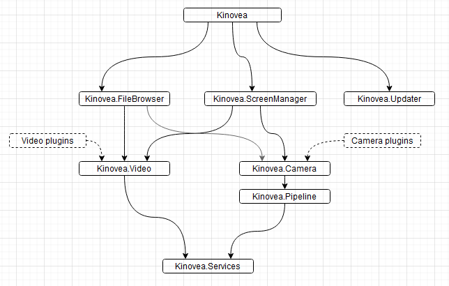

Architecture
============

This document describes the high-level architecture of Kinovea.

High level namespaces/assemblies dependency map
-------------------------

Simplified dependency map.

Main projects
-------------

**Kinovea**

This is the main executable and entry point of the application. 
It contains initialization code and hosts the main window and top level menu. 
Other modules hook themselves into the UI of this project. 
This project also contains the UI for the preferences and the About… dialog.

**Kinovea.FileBrowser**

This project is responsible for the left-hand-side panel containing the file explorer, shortcuts folders and camera list.

**Kinovea.ScreenManager**

This project is responsible for the thumbnail explorer (the central part of the application when no video/camera is loaded), the playback and capture screens and the joint controls for dual playback and dual capture. It manages loading and unloading of the videos and camera in their screens. The screens UI and logic is also in this assembly, as well as all the code for keyframes, drawings, measurements, calibration and synchronization.

**Kinovea.Updater**

This small project is responsible for the code that checks if a new version is available.

**Kinovea.Video**

This project contains a "plugin" manager that loads video readers and route file-open commands to the appropriate reader. 
The actual video readers are implemented in the various projects named Kinovea.Video.Bitmap, Kinovea.Video.FFMpeg, Kinovea.Video.Gif, etc.

Video reader plugins implement interfaces/abstract classes defined in Kinovea.Video. They are not really *plugins* in the sense that all of them are loaded from a static list rather than discovered dynamically.

This project also contains the low level producer/consumer video playback pipeline infrastructure and logic.

**Kinovea.Camera**

This project contains a "plugin" manager that loads camera managers. It routes requests for camera discovery and camera loading to the appropriate plugin. 
The actual camera managers are implemented in the various projects named Kinovea.Camera.DirectShow, Kinovea.Camera.HTTP, etc.

This project also contains shared types used by camera managers like interfaces/abstract classes implemented by plugins, types and events used during the capture process and resource strings and images for configuration dialogs.

Some of the camera managers are not really *plugins* and are loaded from a static list. The *machine vision* plugins are loaded by dynamic discovery and installed separately.

**Kinovea.Pipeline**

This project contains the low level producer/consumer capture pipeline infrastructure and logic.

**Kinovea.Services**

This is a catch-all project containing types and functions shared by multiple parts of the application. 
For example the types used in the preferences, the keyboard shortcuts support classes, the undo history system, the workspace system, etc.

**Kinovea.Video.FFMpeg**

This is a special video module since it also handles *saving* files. Thus unlike all the other video reader plugins it is directly referenced by the video exporting code and the capture code in Kinovea.ScreenManager.

This assembly is written in C++/CLI as it interfaces tightly with FFMpeg.

